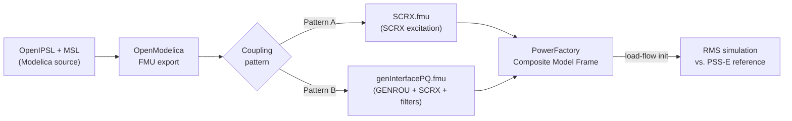

# Modelica-FMI-PowerFactory-ModelImport-Tutorial

**Tutorial and open-source companion for deploying OpenIPSL Modelica models into DIgSILENT PowerFactory via FMI Model Exchange.**

[](./LICENSE) [](https://doi.org/10.5281/zenodo.19859079)

*Repository archived on Zenodo — DOI: [10.5281/zenodo.19859079](https://doi.org/10.5281/zenodo.19859079)*

This repository is the open-source companion to the paper *"Deploying OpenIPSL Models into DIgSILENT PowerFactory via FMI Model Exchange"* by Hao Chang and Luigi Vanfretti, submitted for review to the American Modelica & FMI Conference 2026, Atlanta, GA, USA, October 12–14, 2026. A pre-print is available on [ResearchGate](https://www.researchgate.net/publication/406108844_Deploying_OpenIPSL_Models_into_DIgSILENT_PowerFactory_via_FMI_Model_Exchange).

## Overview

Translating open-source Modelica power-system models into commercial grid-simulation environments remains a practical barrier to using research-grade libraries in utility workflows. The [Open-Instance Power System Library (OpenIPSL)](https://github.com/OpenIPSL/OpenIPSL) provides validated Modelica implementations of synchronous machines, excitation systems, governors, and stabilizers benchmarked against PSS®E, but no published study had documented an end-to-end deployment into DIgSILENT PowerFactory until this work.

This repository provides the complete workflow, Modelica source, pre-compiled FMUs, PowerFactory project files, and a step-by-step visual tutorial for deploying OpenIPSL models into PowerFactory using the Functional Mock-up Interface (FMI) in Model Exchange mode, in which PowerFactory's RMS integrator advances the FMU's states directly.

Two coupling granularities are demonstrated and validated against PowerFactory's native PSS®E SynMach SCRX reference:

- **Pattern A — controller-only coupling**: The OpenIPSL SCRX excitation system is exported as a single-block FMU (`SCRX.fmu`). Four scalar signals cross the FMI boundary (`ECOMP`, `ECOMP0`, `EFD0` in; `EFD` out); the synchronous machine and grid remain native PowerFactory components. This pattern imposes no measurable simulation overhead and is well-suited to prototyping new control laws against a trusted machine and grid.

- **Pattern B — full-machine coupling**: A complete machine-and-controls subsystem — OpenIPSL GENROU round-rotor machine, SCRX excitation, and first-order P/Q boundary filters — is packaged into a single FMU (`genInterfacePQ.fmu`). The grid sees the FMU as a controlled power injector at the generator bus. This pattern is appropriate for studies of novel machine representations or coupled machine–control dynamics.

## Tutorial

> [!NOTE]
> **If you want to reproduce or extend the results from the paper, start here.** The tutorial PDF is the primary hands-on companion to this repository. The Modelica source files, FMUs, and PowerFactory projects are all referenced and used within it.

The file [`PowerFactoryFMI_Tutorial.pdf`](./PowerFactoryFMI_Tutorial.pdf) (45 pages) provides a complete, screenshot-driven walkthrough of how to implement both coupling patterns using the files in this repository. It goes well beyond the paper's narrative description by showing exactly what to click, configure, and verify at each step in OpenModelica and PowerFactory.

**Part I — Pattern A: Controller-only coupling (SCRX FMU)**

This part covers the full workflow for exporting the SCRX excitation system from OpenModelica and integrating it into PowerFactory:

1. Downloading the repository files from GitHub.
2. Setting the OpenModelica working directory and loading `Sources/Modelica/SCRX.mo`.
3. Exporting `SCRX.mo` as a FMI 2.0 Model Exchange FMU from OMEdit.
4. Importing `Sources/PowerFactory/scrxGridFMITest.pfd` into PowerFactory.
5. Creating a Composite Model Frame ("AVR Frame") with correctly named slots and signal mappings (`ECOMP`, `ECOMP0`, `EFD0` in; `EFD` out).
6. Registering the FMU file as a Modelica Model Type (with the "compiled model" flag and FMU path).
7. Creating a Composite Model in the network grid and wiring: synchronous machine → AVR frame → FMU-backed SCRX slot.
8. Running the load-flow initialization and RMS simulation.

**Part II — Pattern B: Full-machine coupling (GENROU+SCRX FMU)**

This part covers the more involved full-machine integration workflow:

1. Cloning OpenIPSL from GitHub and loading it into OMEdit alongside `Sources/Modelica/TestSCRX.mo`.
2. Exporting `TestSCRX.Experiments.genInterfacePQ` as a FMI 2.0 Model Exchange FMU (`genInterfacePQ.fmu`).
3. Importing `Sources/PowerFactory/genGridFMICompare_PQsource_Base.pfd` into PowerFactory.
4. Registering `genInterfacePQ.fmu` as a Modelica Model Type (`fmiPQInterface`) and configuring the two-stage initialization handshake.
5. Creating and wiring the Interface Frame: VoltageSensor, FMU slot, and load slot for P/Q injection.
6. Running the RMS simulation and validating field voltage (`EFD`) and terminal voltage (`Vt`) against the native PSS®E SynMach SCRX reference.

> [!NOTE]
> If you want to skip regenerating the FMUs yourself, the pre-compiled files in `Sources/FMUs/` are ready to use. The tutorial guides you through both the export and the import paths, so you can follow whichever applies to your workflow.

## Workflow



## Repository structure

| Path | Contents |
|---|---|
| `PowerFactoryFMI_Tutorial.pdf` | Step-by-step visual tutorial for both coupling patterns (45 pages) |
| `Sources/FMUs/` | Pre-compiled FMI 2.0 Model Exchange FMUs |
| `Sources/Modelica/` | Modelica source files for the SCRX and GENROU+SCRX export models |
| `Sources/PowerFactory/` | DIgSILENT PowerFactory project files (`.pfd`) |

**Modelica source — `Sources/Modelica/`**

- `SCRX.mo` — Stand-alone SCRX excitation model with `ECOMP0` and `EFD0` declared as External inputs for PowerFactory's initialization handshake. Exported as `SCRX.fmu` (Pattern A).
- `TestSCRX.mo` — Modelica package containing:
  - `TestSCRX.Components.SCRXwInitAsInput` — SCRX re-implementation with initialization values as scalar inputs.
  - `TestSCRX.Components.SCRXexport` — Wrapper around `OpenIPSL.Electrical.Controls.PSSE.ES.SCRX` for direct FMU export.
  - `TestSCRX.Components.PwPin2PF` — Voltage/power boundary block converting between OpenIPSL's `PwPin` interface and PowerFactory's P/Q signals, with first-order output filters.
  - `TestSCRX.Experiments.genInterfacePQ` — Full GENROU + SCRXwInitAsInput + PwPin2PF assembly; exported as `genInterfacePQ.fmu` (Pattern B).
  - `TestSCRX.Experiments.TestWithOpenIPSLInitAsInput` — Modelica-side validation experiment (DASSL solver).
  - `TestSCRX.Experiments.TestWithOpenIPSLOriginalSCRX` — Reference experiment using the unmodified OpenIPSL SCRX.
  - `TestSCRX.Experiments.genInterfaceCurrent` — Alternative current-interface experiment.

**PowerFactory project files — `Sources/PowerFactory/`**

- `scrxGridFMICompare.pfd` — Pattern A benchmark: two-machine grid with `SCRX.fmu` in a Composite Model Frame for GEN1.
- `genGridFMICompare_PQsource_Base.pfd` — Pattern B benchmark: same grid with `genInterfacePQ.fmu` as a P/Q injector at the GEN1 bus.

## Requirements

**Modelica tool for FMU export:** OpenModelica v1.22 or later is required to reproduce the FMU files from source.

**Modelica tool for simulation:** Dymola 2025x or later (tested; DASSL solver) can run the `TestSCRX.Experiments` simulations directly. Other MSL 4.0.0-compatible tools are untested.

**Dependency libraries** (load before `TestSCRX.mo`):

- OpenIPSL 3.1.0-dev or compatible
- Modelica Standard Library (MSL) 4.0.0

**Grid simulation tool:** DIgSILENT PowerFactory 2022 or later (FMI Model Exchange support was introduced in PowerFactory 2022). FMI 2.0 Model Exchange is used; PowerFactory's native Modelica modeling is not required.

> [!NOTE]
> If you only want to run the pre-configured PowerFactory simulations, the pre-compiled `.fmu` files in `Sources/FMUs/` are ready to use — OpenModelica and Dymola are not needed.

## Getting started

```bash
git clone https://github.com/ALSETLab/Modelica-FMI-PowerFactory-ModelImport-Tutorial.git
```

Then open [`PowerFactoryFMI_Tutorial.pdf`](./PowerFactoryFMI_Tutorial.pdf) and follow the steps for whichever pattern you need. The tutorial covers both patterns end-to-end, from FMU export through to RMS simulation and result validation.

If you want to reproduce the FMUs from scratch rather than using the pre-compiled ones, you will additionally need OpenModelica v1.22+ and the OpenIPSL 3.1.0-dev library (see [Tutorial Part II](#tutorial) for the full export steps).

## How to cite

This paper is currently submitted for review. A pre-print is available on [ResearchGate](https://www.researchgate.net/publication/406108844_Deploying_OpenIPSL_Models_into_DIgSILENT_PowerFactory_via_FMI_Model_Exchange).

If you use this tutorial, the models, or the workflow in your work, please cite:

> H. Chang and L. Vanfretti, "Deploying OpenIPSL Models into DIgSILENT PowerFactory via FMI Model Exchange," submitted for review, American Modelica & FMI Conference 2026, Atlanta, GA, USA, October 12–14, 2026.

```bibtex
@inproceedings{Chang2026FMIPowerFactory,
  author    = {Chang, Hao and Vanfretti, Luigi},
  title     = {Deploying {OpenIPSL} Models into {DIgSILENT} {PowerFactory} via {FMI} Model Exchange},
  booktitle = {Proceedings of the American Modelica \& FMI Conference 2026},
  address   = {Atlanta, GA, USA},
  month     = {October},
  year      = {2026},
  note      = {Under review. Pre-print: \url{https://www.researchgate.net/publication/406108844}}
  % TODO: add pages and DOI after publication
}
```

To cite the repository itself:

> H. Chang and L. Vanfretti, *Modelica-FMI-PowerFactory-ModelImport-Tutorial*, Zenodo, 2025. DOI: [10.5281/zenodo.19859079](https://doi.org/10.5281/zenodo.19859079).

## License

BSD 3-Clause. Copyright © 2025 ALSETLab. See [LICENSE](./LICENSE).

## Authors and acknowledgments

**Authors:**
- Hao Chang — Electrical, Computer and Systems Engineering Department, Rensselaer Polytechnic Institute, Troy, NY, USA
- Luigi Vanfretti — Electrical, Computer and Systems Engineering Department, Rensselaer Polytechnic Institute, Troy, NY, USA

This work was supported in part by the [Elia Group and Energinet Research Challenge for Innovation in Power Systems](https://www.mccs.com/en/latest-news/20250602_update-on-elia-group-energinet-research-challenge), managed by 50Hertz Transmission GmbH and Energinet (Research Question 4b).
